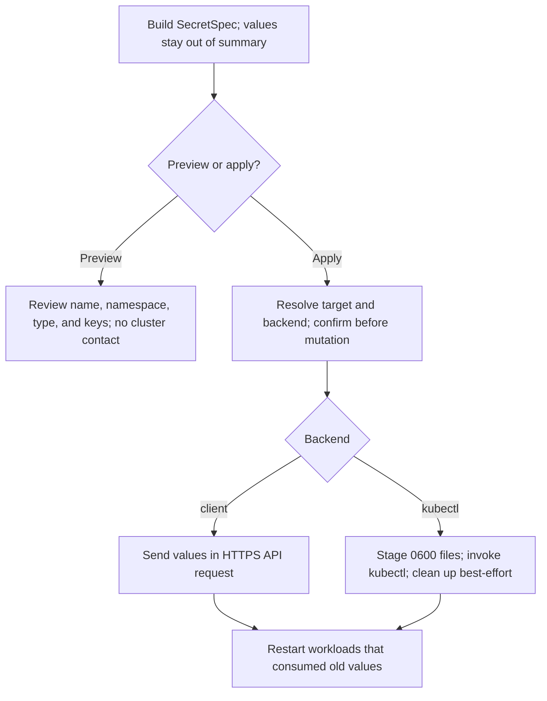

# Kubernetes Utilities

## Overview

`pnutils.k8s` provides a small Python facade for common Kubernetes reads,
helpers for preparing and applying Secrets, and the `pnutils-k8s` CLI. Use it
when Python automation needs these focused operations without taking ownership
of a full Kubernetes client abstraction.

## Production Design Overview

Read operations use the official Kubernetes Python client. Secret specs can
be applied through that client or `kubectl`; CLI preview is separate from the
apply step. Both backends use Server-Side Apply with the `pnutils` field
manager. A conflict with fields owned by another manager is reported rather
than silently taking ownership.



## What To Configure

| Setting | Options and default | Use and impact |
| --- | --- | --- |
| Kubernetes client extra | `pnutils[k8s]`; optional | Provides the official Python client for API reads and the `client` Secret backend. |
| Secret backend | `auto` (default), `client`, `kubectl` | `auto` prefers the Python client when installed, otherwise `kubectl`. A client configuration or API failure does not trigger a fallback. Use one backend consistently for repeated Secret updates. |
| Cluster configuration | `context=None`, `in_cluster=None` | `KubernetesClient` tries in-cluster configuration, then local kubeconfig. A supplied `context` selects that kubeconfig context; set `in_cluster` to `True` or `False` to force a source. Each client has its own configuration. |
| CLI mutation | Preview by default; `--apply` enables mutation | `--force` skips the confirmation prompt and is valid only with `--apply`; reserve it for trusted automation. |

The `kubectl` backend requires the `kubectl` executable on `PATH`. Certificate
generation requires `openssl`; see the [certificate guide](../ssl_certs/README.md).

## How To Run

Install the client extra for API access:

```bash
uv add 'pnutils[k8s]'
```

List pods with the Python client:

```python
from pnutils.k8s import KubernetesClient

with KubernetesClient(context="production") as kube:
  pods = kube.list_pods(namespace="payments", label_selector="app=api")
```

Apply a generic Secret using an environment variable. The Python API applies
immediately unless a confirmation callback is supplied:

```python
from pnutils.k8s import SecretSpec, apply_secret, secret_data_from_env

data = secret_data_from_env({"token": "PAYMENTS_TOKEN"})
spec = SecretSpec.generic("payments-token", "payments", data)
result = apply_secret(spec, backend="client")
```

The CLI previews by default and prompts before applying:

```bash
export SECRET_VALUE='replace-me'
pnutils-k8s push-env-secret --name payments-token --namespace payments \
    --key token --value-env SECRET_VALUE
pnutils-k8s push-env-secret --name payments-token --namespace payments \
    --key token --value-env SECRET_VALUE --apply
```

Use `--backend kubectl` to select that backend explicitly. For unattended
automation, add `--apply --force` only when the target context is controlled
and independently verified. `--force` bypasses the CLI confirmation prompt;
it does not override Server-Side Apply field conflicts. To preview a TLS Secret for a Service, use
`pnutils-k8s push-tls-secret --name payments-tls --namespace payments
--service-name payments`; add `--apply` to generate or load the certificate
and apply it. Existing PEM pairs can be selected with both `--cert-file` and
`--key-file`.

## API Reference

For complete public signatures and source docstrings, see the
[generated Kubernetes API reference](https://prasadnadig.github.io/pnutils/api/k8s/).
The `pnutils-k8s` command is also documented in the generated
[CLI reference](https://prasadnadig.github.io/pnutils/api/cli/).

## Security and Hardening

Keep credentials out of command-line arguments and logs. `secret_data_from_env`
reads values from environment variables, but environment variables and shell
history may themselves retain sensitive values. `SecretSpec` excludes its data
from `repr` and summaries expose only key names.

The `client` backend sends values from memory in the HTTPS API request body.
The `kubectl` backend stages values in `0600` files inside a `0700` temporary
directory so they do not appear in `kubectl` arguments. Cleanup overwrites and
removes these files on normal exit, but this is best-effort: `SIGKILL`, power
loss, backups, snapshots, or copy-on-write filesystems may preserve data. If
cleanup reports a remaining path, delete it and rotate the credential or
reissue the certificate. Give the Kubernetes identity only the permissions
needed for the requested namespace and operation, and protect kubeconfig and
service-account credentials.

## Operational Runbook

- Before applying, verify the selected context, namespace, Secret name, keys,
  backend, and the source of each value.
- Review the CLI preview or `SecretSpec.summary()` before an API call. For
  automated Python applies, use the `confirm` callback if an explicit gate is
  required.
- After applying, verify the Secret through an appropriately scoped identity
  and restart workloads that already read the previous value.
- If an apply fails with a field conflict, inspect field ownership and resolve
  it before retrying. Both backends use the same field manager and apply
  semantics.

## Cross-environment Notes

The Python client supports local kubeconfig contexts and in-cluster service
accounts with per-instance configuration. `kubectl` uses the current kubeconfig
context. Verify the target before a production mutation. Self-signed TLS
certificates must be explicitly trusted by every client.