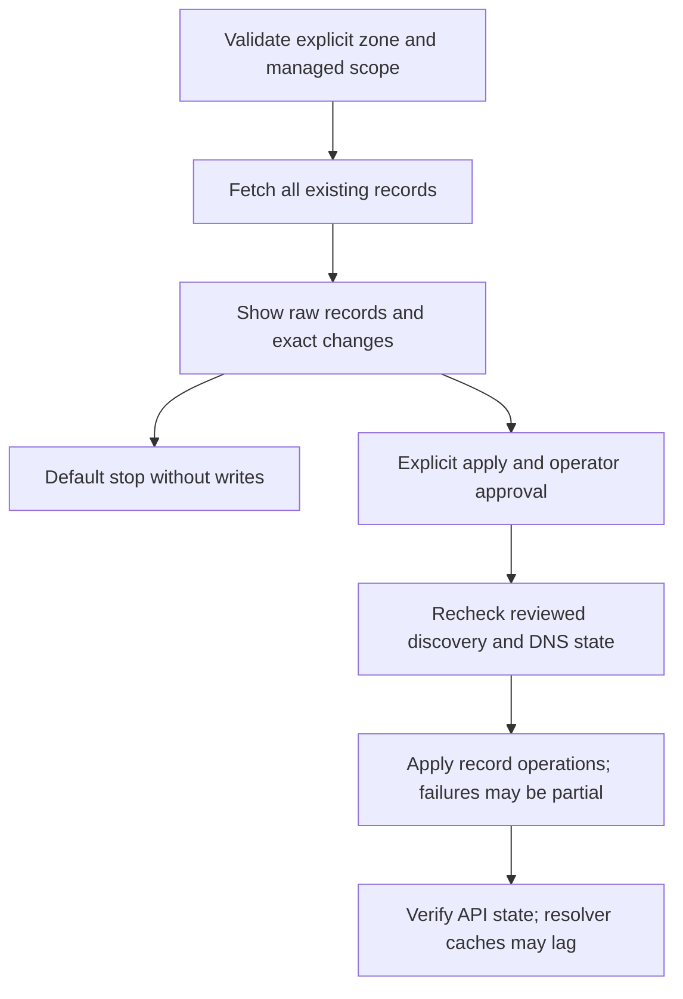

# Linode DNS

## Overview

Preview-first DNS record management for operators and CI. Install the
`pnutils[linode]` extra for YAML input. JSON input and the HTTPS API client use
the standard library. Importing the package does not eagerly import PyYAML.
Python 3.9 remains the minimum. See the generated Linode API reference for the
public Python interface, which is documented in source.

## Production Design Overview

The tool manages records in **existing primary zones**, not zone creation,
registrar settings, or Kubernetes discovery. A consumer such as ground derives
desired records and delegates to this package. Tokens identify environment
variables, never credential values. All records are fetched with pagination;
the raw API snapshot and pending operations are displayed before approval.



## What To Configure

Use schemaVersion 1 with a nonempty zones list. Each zone supplies name,
tokenEnv, mode, managedRecordSets, and records. Records use Linode API field
names, notably `ttl_sec`, not `ttl`. `@` means the apex; names otherwise are
relative to the zone, or fully qualified within it. Use trailing dots for an
unambiguous fully qualified name. Wildcard record owners are not supported.

```yaml
schemaVersion: 1
zones:
  - name: greet.example.org
    tokenEnv: LINODE_GREET_APP_DOMAIN_TOKEN
    mode: reconcile
    managedRecordSets:
      - {name: "@", type: A}
    records:
      - {name: "@", type: A, target: 203.0.113.10, ttl_sec: 300}
```

The address is an example, not a production destination. Supported types are
A, AAAA, CNAME, TXT, NS, MX, CAA, SRV, and PTR. Validate type-specific fields:
MX priority, CAA tag, and SRV service/protocol/priority/weight/port. Names and
address families, duplicate desired records, CNAME conflicts, and supported
provider TTL values are checked. Unknown keys and duplicate YAML/JSON keys
are rejected. Provider-specific restrictions are still authoritative.

Modes are mutually exclusive:

| Need | Mode | Meaning |
| --- | --- | --- |
| Routine updates | `reconcile` | Keep identical records; update same-type records in place within scope |
| Remove scoped records | `clean` | Require `records: []`; delete selected records |
| Recreate scoped records | `replace` | Delete selected records and recreate desired records |

For scoped cleaning, keep the example's managedRecordSets and change to:

```yaml
mode: clean
records: []
```

For destructive recreation, keep its records and scope and use `mode: replace`.
For a deliberate whole-zone wipe, omit the scope and use:

```yaml
mode: clean
managedRecordSets: []
records: []
allowZoneWipe: true
```

Whole-zone recreation uses `mode: replace`, `allowZoneWipe: true`, an empty
scope, and an explicit desired records list. Interactive wipes require typing
`WIPE`. Neither scoped nor zone-wide operations alter SOA, apex NS, or
`_acme-challenge` record owners. Parent subdomain NS delegation is allowed
only through an explicit managed NS set. Other records are protected only by
scope, not their type: an acknowledged zone wipe can remove MX, CAA, and TXT.
Do not use it for normal deployments.

## How To Run

From any directory after installing the package, load the named token through
your secret manager or environment, then run:

```bash
pnutils-linode dns show --zone greet.example.org --token-env LINODE_GREET_APP_DOMAIN_TOKEN
pnutils-linode dns validate --file dns.yaml
pnutils-linode dns records --file dns.yaml
pnutils-linode dns records --file dns.yaml --apply
```

`validate` is offline. `show` and record previews perform API reads but no
writes. An interactive apply requires typing `yes`; a decline changes nothing.
Without a terminal, apply fails unless `--force` is explicitly paired with
`--apply`. No Kubernetes component or background controller is installed.

### CI Approval

```bash
pnutils-linode dns records --file dns.yaml --plan-out reviewed-plan.json
# After the pipeline's approval gate:
pnutils-linode dns records --file dns.yaml --plan-in reviewed-plan.json --apply --force
```

Plan export is exclusive (no overwrite), mode 0600, and optional. Applying
requires the input, complete raw DNS snapshot, zone ID, and operation list to
match the approved plan. A consumer may also bind cluster identity and
discovery facts. Any drift requires a new plan and approval, not a silently
updated operation list. Store the immutable plan as an access-controlled CI
artifact; do not commit raw snapshots.

## Security And Hardening

Use provider-enforced per-zone user/entity permissions. A Domains read/write
token alone does not restrict access to one zone. Grant only read access for
preview jobs and the required write permissions to approved apply jobs.
Tokens remain in memory and the source environment; this tool neither stages
nor logs them. Environment variables and secret-manager state still hold the
credentials. Rotate exposed credentials.

Raw records are intentionally displayed as requested, and TXT values can be
sensitive. Restrict terminal logs, pipeline logs, and exported plan artifacts.
The API client uses a fixed HTTPS endpoint, bounded timeouts, and refuses
redirects. Write requests are not automatically retried.

## Operational Runbook

Before apply, verify zone identity, ownership scope, current records, and the
exact change list. The complete snapshot is rechecked before writes; this is
optimistic detection, **not a provider-side atomic lock**. Avoid concurrent DNS
writers for the same managed sets. Concurrent ACME changes may invalidate a
plan even though challenge records are protected.

Record writes are not transactional. Replacement and changes requiring
delete/create can briefly remove records. On any failure, fetch current state
and replan: the provider may have committed a request whose response was lost.
Do not promise automatic rollback; reconstruct reviewed records deliberately.
After success, the API state is verified, but authoritative DNS and cached
resolvers may lag. Check public delegation and resolution separately with
`dig`; an API match is not proof of worldwide propagation.

## Cross-environment Notes

The package does not assume Linode Kubernetes Engine, Envoy, or any domain
suffix. Ground's adapter supports public IP addresses and non-apex hostname
destinations. Zone-apex CNAME and provider-specific ALIAS records are not
supported; hostname-only apex LoadBalancers require a different topology.

## API Sources

- [List records](https://techdocs.akamai.com/linode-api/reference/get-domain-records)
- [Create records](https://techdocs.akamai.com/linode-api/reference/post-domain-record)
- [Update records](https://techdocs.akamai.com/linode-api/reference/put-domain-record)
- [Delete records](https://techdocs.akamai.com/linode-api/reference/delete-domain-record)