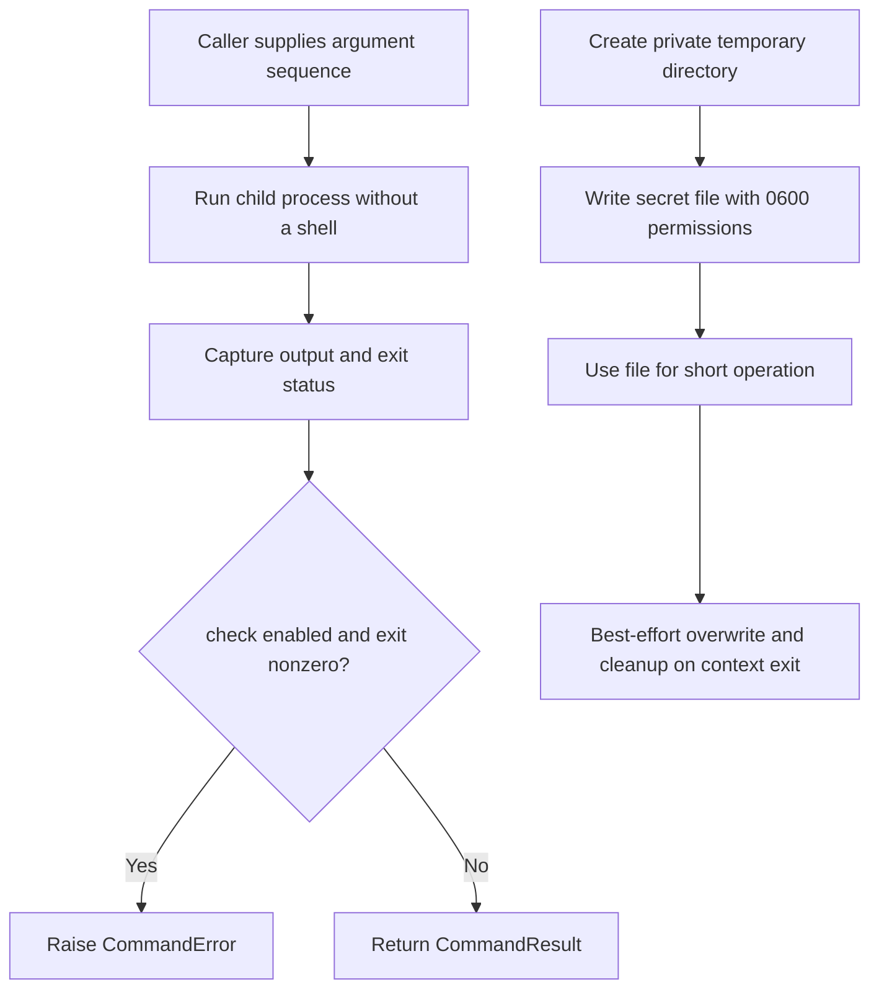

# Script Helpers

## Overview

`pnutils.scripts` contains small helpers for Python command-line programs:
subprocess execution, logging setup, and secure temporary files for short-lived
secret staging. It has no third-party runtime dependency.

## Ownership Boundary

The module wraps standard-library behavior; it does not provide a shell,
application logger, or durable secret store. `run` executes a program directly
without shell interpretation. Secret-file helpers reduce exposure during
short operations but do not guarantee physical erasure on every filesystem.

## Production Design Overview

Commands are launched with an argument sequence and captured output; callers
choose whether a nonzero exit raises or is returned. Secret files are created
only inside an explicit temporary-directory context and cleaned up when it
exits.



## How To Use

Run a command without a shell and inspect captured output:

```python
from pnutils.scripts import run_command

result = run_command(["git", "rev-parse", "HEAD"], timeout=10)
print(result.stdout.strip())
```

By default, a nonzero exit raises `CommandError`. Set `check=False` to receive
the exit status in `CommandResult`; timeouts propagate as
`subprocess.TimeoutExpired`.

Configure logging and stage a short-lived secret file:

```python
from pnutils.scripts import setup_logging, temporary_secret_directory, write_secret_file

logger = setup_logging()
with temporary_secret_directory(prefix="my-tool-") as directory:
    secret_path = write_secret_file(directory, "token", "value-from-memory")
    logger.info("staged secret file at %s", secret_path.name)
```

Do not log the secret contents or pass credentials through process arguments.
The helper removes staged files when the context exits.

## API Reference

For complete public signatures and source docstrings, see the
[generated script-helper API reference](https://prasadnadig.github.io/pnutils/api/scripts/).

## Configuration Surface

`run_command` accepts `cwd`, `env`, `timeout`, `check`, and `input_text`. If `env` is
provided, it replaces the child process environment rather than merging with
it. `args` must be a sequence of strings, never a single string. `setup_logging`
accepts a logging level, format, and optional logger; the default target is the
root logger. `temporary_secret_directory` accepts an optional filename prefix.

## Security and Hardening

Arguments are included in `CommandResult` and nonzero-exit error messages, so
never place credentials in `args`. Use `input_text` or a restricted file-based
interface when the target program supports it. The subprocess is launched
without a shell, which avoids shell expansion but does not make unsafe argument
choices harmless.

`temporary_secret_directory` creates directories with `0700` permissions and secret files
with `0600`. Cleanup overwrites and unlinks files on normal exit; abrupt
termination, power loss, backups, snapshots, and copy-on-write or
log-structured filesystems can retain data. If cleanup prints a warning, delete
the named path and rotate the credential. Do not treat this helper as secure
long-term storage.

## Operational Runbook

- Keep credentials out of process arguments, log messages, and captured output.
- Set a timeout when a child process must not run indefinitely.
- If `env` is supplied to `run`, include every variable the child needs because
  that mapping replaces the inherited environment.
- Check `CommandResult.returncode` when using `check=False`.
- If temporary-file cleanup warns, delete the named path and rotate the
  credential.

## Cross-environment Notes

The helpers rely on Python's standard library and run on supported Python
platforms. File permission modes and overwrite guarantees depend on the host
filesystem; do not assume that every operating system or storage layer provides
the same cleanup behavior.