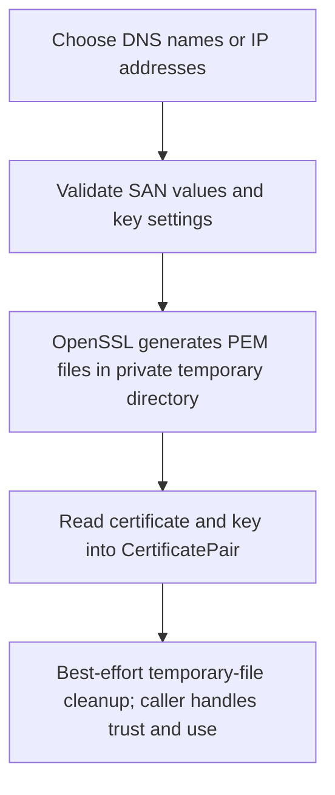

# X.509 Certificate Helpers

## Overview

`pnutils.ssl_certs` generates self-signed X.509 certificate pairs or loads an
existing PEM certificate and private key into a `CertificatePair`. It is
protocol-agnostic and requires the `openssl` executable only for generation.

## Production Design Overview

Generation validates the requested subject alternative names, creates the
certificate and private key in a private temporary directory, reads them into
memory, and cleans up the temporary files. Loading an existing pair reads both
files into memory without modifying them.



## What To Configure

| Option | Default | Runtime impact |
| --- | --- | --- |
| `dns_names` | Empty; falls back to `common_name` | Adds DNS Subject Alternative Names. Provide names clients will actually use. |
| `ip_addresses` | Empty | Adds validated IP Subject Alternative Names. At least one DNS name or IP is required. |
| `validity_days` | `825` | Certificate lifetime; must be positive. |
| `key_bits` | `2048` | RSA key size; values below 2048 are rejected. |

## How To Run

Generate a certificate for a service name and read the PEM values from memory:

```python
from pnutils.ssl_certs import generate_self_signed_certificate

certificate = generate_self_signed_certificate(
    "payments.example",
    dns_names=["payments.example", "payments.internal"],
  validity_days=90,
)
```

Load an existing certificate and matching key:

```python
from pnutils.ssl_certs import load_certificate_pair

certificate = load_certificate_pair("tls.crt", "tls.key")
```

The private key is available as `certificate.private_key_pem` for the consuming
workflow, but is excluded from `repr(certificate)`. Kubernetes Service DNS
names and Secret integration are provided by
`pnutils.k8s.generate_service_certificate` and
[`pnutils.k8s`](../k8s/README.md).

## API Reference

For complete public signatures and source docstrings, see the
[generated X.509 API reference](https://prasadnadig.github.io/pnutils/api/ssl_certs/).

## Security and Hardening

A self-signed certificate is not trusted automatically. Configure every
intended client to trust or pin it, or use a certificate issued by your
organization's trusted CA for production services. Protect `private_key_pem` as a
credential and avoid logging or serializing it.

During generation, the private key is written to a `0700` temporary directory
and removed through the shared best-effort cleanup helper. Abrupt termination,
power loss, snapshots, backups, and copy-on-write or log-structured filesystems
may retain the file data. Use the operating environment's approved key
management process when these limitations are unacceptable.

## Operational Runbook

- Confirm all DNS names and IP addresses match the endpoints clients use.
- Check the certificate's lifetime and arrange renewal before expiration.
- Distribute trust for self-signed certificates before deploying them.
- Keep the private key restricted; if exposed, replace the certificate and
  rotate the key.
- If generation reports a missing `openssl`, install and verify OpenSSL on the
  host. Certificate generation does not require a Python crypto package.

## Cross-environment Notes

Generation shells out to whichever `openssl` executable is found on `PATH`,
so availability and version are host-specific. Existing PEM loading uses
Python file I/O and does not require OpenSSL. Kubernetes-specific Service SAN
defaults belong to `pnutils.k8s.generate_service_certificate`, not this generic module.